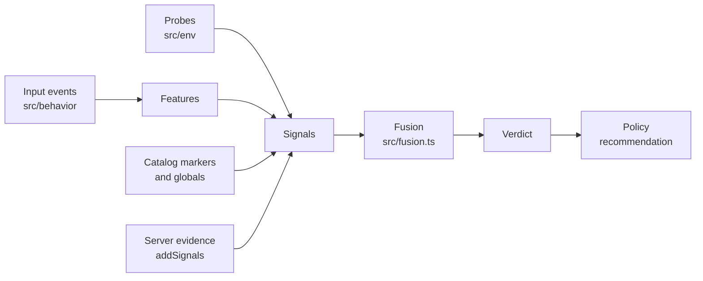

# How it works



## Signals

Everything the engine knows is a `Signal`:

```ts
{ code: 'env.webgl_software', group: 'E', target: 'both', llr: 2.2, detail: 'SwiftShader' }
```

- **`code`**: stable id, `prefix.name`. Never renamed once shipped. [All codes](signals.md).
- **`llr`**: natural-log likelihood ratio, P(observation | automation) / P(observation | human). Positive is
  evidence for automation, negative is evidence for a human.
- **`target`**: which hypothesis it supports: `bot`, `agent` or `both`.
- **`hard`**: deterministic proof (`navigator.webdriver`, an agent's own DOM overlay). Short-circuits the verdict.
- **Missing is not negative.** A probe that cannot run emits nothing.

## Groups

Correlated observations share a group, and each group's total is capped so five WebGL tells cannot count five
times.

| Group | Evidence | Cap | Scaled by |
|---|---|---|---|
| A | Hard automation and agent artefacts | 12 | |
| E | Environment consistency | 4 | |
| D | Input driving (CDP, synthetic events) | 6 | drive reliability |
| R | Rhythm (think time) | 3 | behaviour reliability |
| C | Biometrics | 3 | behaviour reliability |
| H | Server headers | 6 | |
| J | Judge model | 3 | |

Behaviour groups are scaled by **reliability**: how much interaction was actually observed. A short visit with no
events contributes nothing either way.

## Fusion

For each non-human class c ∈ {bot, agent}:

```
L_c = log(prior_c · boost_action / prior_human)  +  Σ_groups  reliability_g · clamp(Σ llr_i, ±cap_g)
P   = softmax(0, L_bot, L_agent)
```

Then, in order:

1. **Bot or agent.** An environment score (is the browser fake?) and a driving score (are the hands non-human?)
   separate the two: a real browser driven by non-human input leans agent, a fake browser leans bot.
2. **Hard evidence.** A server-verified identity (`verified.*`, group H) or an agent's own artefact sets the
   winning class to 0.99; a verified identity wins over everything. An automation tool alone (`auto.webdriver`,
   `global.playwright`) proves only that the visit is not human: it is `bot` at 0.99, or `agent` at 0.99 when the
   driving is strong and deliberate (driving score > 0.85 with think-then-act rhythm).
3. **Corroboration.** Without hard evidence, or at least two independent behaviour families (geometry, timing,
   text, coordinates), the verdict stays a low-confidence `human` lean. Environment oddities alone never accuse:
   privacy browsers, extensions and VMs are real people too.
4. **Confidence** grows with evidence mass and distance from the decision boundary.

**Attribution.** `resolveRoles` names the agent, its operator, the controller and the client separately, each
with its own evidence, and never depends on the order signals arrived in. A shared IP list proves an operator
but no product; automation tools and HTTP libraries are controllers, never agents.

## Recommendation

`DEFAULT_SIGNATURES.policies[profile][action]` maps P(non-human) to an action:

| Action | challenge at | deny at |
|---|---|---|
| `login` | 0.6 | 0.9 (step-up, not deny) |
| `signup` | 0.5 | 0.85 |
| `checkout`, `payment` | 0.8 | |
| `pageview` | tag only | |

Humans always get `allow`. `gov` never goes past `tag`. See [src/signatures.ts](../src/signatures.ts) for every
profile.

## Stages

Browser verdicts are `provisional`. A server can add header or network evidence (group H) with `addSignals`; a judge
signal (group J) marks the verdict `final`. The engine keeps re-scoring as input arrives, so a verdict can change during the visit: an agent
that started with human-like input is caught when its driving gives it away.

## Weights

Priors come from vendor traffic reports (Imperva, Cloudflare Radar, DataDome). Per-signal weights are expert
estimates that still need validation on labelled traffic. They are heuristics, not a calibrated model, and pull
requests with evidence that improves them are welcome ([CONTRIBUTING](../CONTRIBUTING.md#rules)).
